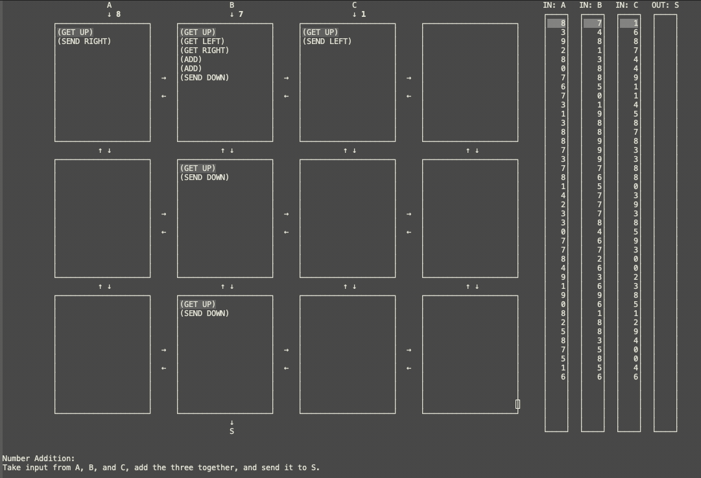
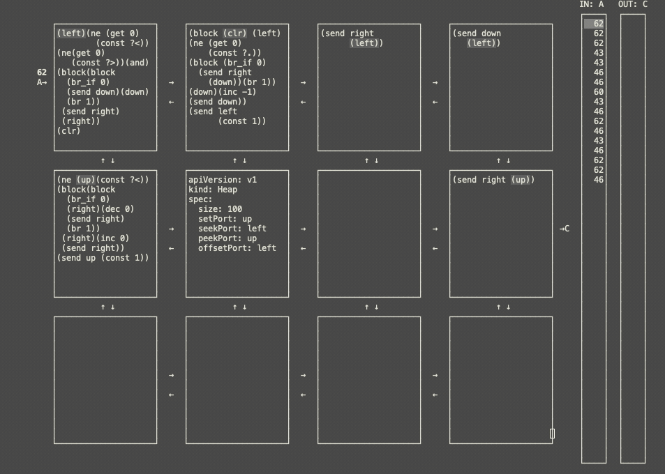

  

# asm-blox: a programming game inspired by WAT and YAML

  Solve a variety of puzzles involving moving data using WAT and YAML.
  The game is played on a 3x4 grid where each grid can hold 11 lines
  of text.  Nodes can send to adjacent notes number values.  Using
  YAML, you can define extra components such as stacks and heaps to
  help you solve your puzzles.

  

  

# Installation

  The game is still in progress but you can install it by adding the
  files in your load path and calling `(require 'asm-blox)`.

# Selecting a Puzzle

  You can initialize a game with the command <kbd>M-x asm-blox</kbd>.
  This will open up a menu with a list of puzzles to choose from.  By
  pressing <kbd>RET</kbd> a new solution to that puzzle will be
  created.  Back on the puzzle selection screen, you can view and open
  up saved files by pressing <kbd>RET</kbd> on the `[1]`-like text.


# Getting Started

  asm-blox is based loosely on the text version of web-assembly.  The
  syntax is low-level assembly instructions written as s-expression.
  Each instruction manipulates a tiny stack related to the current
  cell.  For example the command `(const 10)` will push the number 10
  onto the stack.  To run your program, press <kbd>C-c C-c</kbd>.

  Reading the prompt, your goal is to send particular values to the
  output port (arrow going out of the game grid), most of the time
  reading and manipulating data from the input port(s).

  You can send messages across the various cells via the `send` and
  `get` commands.  The available places you can send and receive
  messages to are the ports `up`, `down`, `left`, and `right`.  For
  example, to send the value 10 down, you can write:

  ```
  (const 10)
  (send down)
  ```

  Expressions can be nested (see documentation) which will run the
  nested statements first, then the parent expression.  So the above
  statement could be written as:

  ```
  (send down
    (const 10))
  ```

  We can nest expressions arbitrarily.  For example, to send `up` the sum
  of the values on the `left` and `right` port you could write:

  ```
  (send up
    (add (get left)
         (get right)))
  ```

  Conditions and loops are done WASM style, no labels and jumps to be
  seen. The block commands are:

  - `block` : when `br`'ed to, go to the blocks end
  - `loop` : when `br`'ed to, go the the blocks beginning

  and the 'br' commands are:

  - `br` : unconditionally jump
  - `br_if` : if the top item on the stack is not zero jump

  Using these constructs, arbitrarily complex control flow can be
  formed.  Remember that if you can't fit all the logic you want into
  one cell, try splitting it into multiple cells.

  For more information please refer to [the manual](./doc/asm-blox.pdf).

## YAML Blocks

  Aside from ASM you can define a cell to be a stack or heap.  You can
  use as many stacks or heaps as you want in order to solve your
  problem, beware though that you only have a total of 12 cells to
  solve the puzzle.  The three top-level objects to define are
  `apiVersion`, `kind`, and `spec`.  `apiVersion` should always be
  "v1", `kind` can be either `Stack`, `Heap`, or `Controller`
  (controller is used for special types of puzzles).  The `spec` field
  varies by the kind.  For example, the following is a definition of a stack:

  ```yaml
  apiVersion: v1
  kind: Stack
  spec:
    size: 10
    inputPorts:
      - left
    outputPort:
      right
  ```
